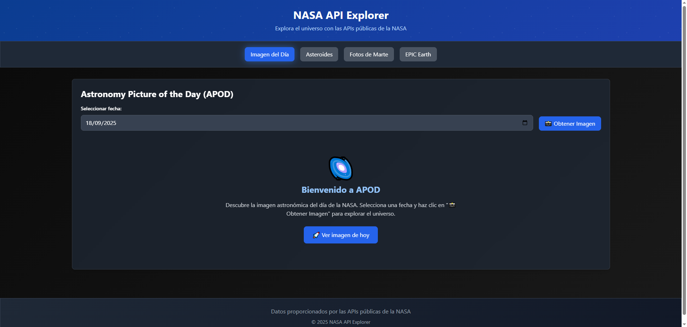
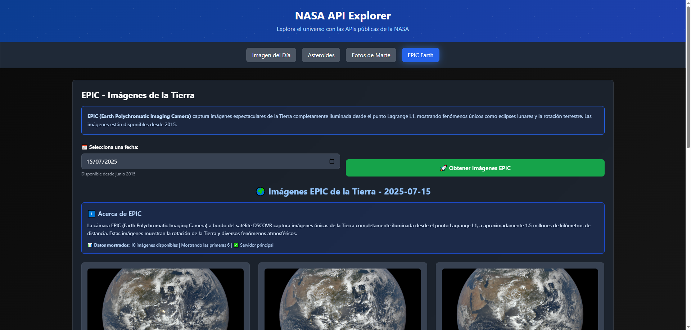
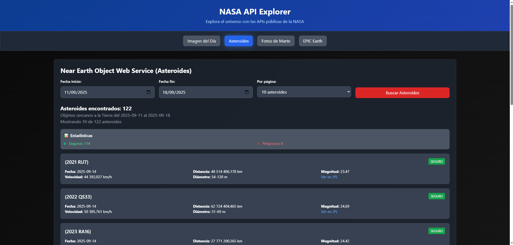
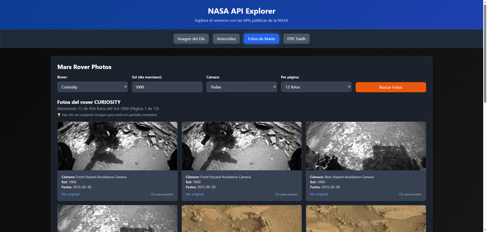

# 🚀 NASA API Explorer

[](https://developer.mozilla.org/en-US/docs/Web/HTML)
[](https://developer.mozilla.org/en-US/docs/Web/CSS)
[](https://developer.mozilla.org/en-US/docs/Web/JavaScript)
[](https://tailwindcss.com/)
[](https://api.nasa.gov/)

Una aplicación web interactiva que consume múltiples APIs de la NASA para explorar el cosmos. Desarrollada con **JavaScript Vanilla**, **HTML5**, **CSS3** y **Tailwind CSS**.

## 🌟 Características Principales

### 🖼️ APOD - Astronomy Picture of the Day
- Visualización de la imagen astronómica del día de la NASA
- Soporte para imágenes y videos de alta resolución
- Sistema de carga inteligente con fallbacks múltiples
- Información detallada incluyendo descripción, fecha y copyright

### 🌍 EPIC - Earth Polychromatic Imaging Camera
- Imágenes únicas de la Tierra desde el punto Lagrange L1
- Vista completa del planeta desde 1.5 millones de kilómetros
- Metadatos científicos avanzados (coordenadas, posición lunar)
- Navegación entre múltiples imágenes del día

### ☄️ Asteroides Cercanos a la Tierra (NEO)
- Base de datos completa de asteroides potencialmente peligrosos
- Filtrado por rangos de fechas personalizables
- Información detallada: velocidad, distancia, tamaño, magnitud
- Sistema de paginación avanzado con estadísticas

### 🔴 Fotos de Rovers Marcianos
- Acceso a las imágenes de Curiosity, Opportunity, Spirit y más
- Filtrado por rover, sol (día marciano) y cámara específica
- Vista de galería con modal de pantalla completa
- Carga lazy para optimización de rendimiento

## 🛠️ Tecnologías Utilizadas

- **Frontend**: HTML5, CSS3, JavaScript ES6+
- **Framework CSS**: Tailwind CSS
- **APIs**: NASA Open Data Portal
- **Arquitectura**: Vanilla JavaScript (sin frameworks)
- **Responsive Design**: Mobile-first approach
- **Optimizaciones**: Lazy loading, paginación, caching

## 🚀 Demo en Vivo

[🌐 Ver Demo](https://santydesignscr.github.io/NASA-API-Explorer/)

## 📱 Capturas de Pantalla

### Imagen Astronómica del Día (APOD)


### Imágenes EPIC de la Tierra


### Asteroides Cercanos


### Fotos de Rovers Marcianos


## 🔧 Instalación y Uso

### Prerrequisitos
- Navegador web moderno
- Servidor web local (opcional para desarrollo)
- API Key de NASA (gratuita)

### Ejecutar

1. **Clona el repositorio**
```bash
git clone https://github.com/tu-usuario/nasa-api-explorer.git
cd nasa-api-explorer
```

2. **Configura la API Key**
   - Obtén una API key gratuita en [NASA API Portal](https://api.nasa.gov/)
   - Edita `app.js` y reemplaza `NASA_API_KEY` con tu clave

3. **Ejecuta la aplicación**
```bash
# Opción 1: Servidor Python
python -m http.server 8000

# Opción 2: Servidor Node.js
npx serve .

# Opción 3: Live Server (VS Code Extension)
# Clic derecho en index.html → "Open with Live Server"
```

4. **Accede a la aplicación**
   - Abre tu navegador en `http://localhost:8000`

## 🏗️ Estructura del Proyecto

```
nasa-api-explorer/
├── index.html          # Estructura principal HTML
├── app.js             # Lógica JavaScript y llamadas API
├── styles.css         # Estilos CSS personalizados
├── README.md          # Documentación del proyecto
└── screenshots/       # Capturas de pantalla (opcional)
    ├── apod-section.png
    ├── epic-section.png
    ├── asteroids-section.png
    └── mars-section.png
```

## 🌐 APIs Utilizadas

| API | Endpoint | Descripción |
|-----|----------|-------------|
| **APOD** | `https://api.nasa.gov/planetary/apod` | Imagen astronómica del día |
| **EPIC** | `https://epic.gsfc.nasa.gov/api` | Imágenes de la Tierra desde el espacio |
| **Asteroids NeoWs** | `https://api.nasa.gov/neo/rest/v1/feed` | Objetos cercanos a la Tierra |
| **Mars Rover Photos** | `https://api.nasa.gov/mars-photos/api/v1/rovers` | Fotografías de rovers marcianos |

## ✨ Características Técnicas

### 🎯 Funcionalidades Avanzadas
- **Paginación Inteligente**: Sistema de paginación con navegación rápida
- **Manejo de Errores**: Fallbacks y reintentos automáticos
- **Responsive Design**: Optimizado para móviles, tablets y desktop
- **Loading States**: Indicadores de carga con animaciones
- **Tooltips Informativos**: Ayuda contextual para usuarios

### 🔄 Optimizaciones
- **Timeout Handling**: Manejo inteligente de timeouts
- **Modal Gallery**: Vista de pantalla completa para imágenes
- **Keyboard Navigation**: Navegación con teclado (Enter, ESC)

### 🎨 Experiencia de Usuario
- **Dark Theme**: Tema espacial oscuro
- **Smooth Animations**: Transiciones suaves
- **Interactive Elements**: Hover effects y feedback visual
- **Accessibility**: Navegación accesible y semántica
- **Mobile Optimized**: Gestos touch y responsive

## 📄 Licencia

Este proyecto está bajo la Licencia GNU GPL-3.0.

## 👨‍💻 Autor

**Santiago Rodríguez**
- GitHub: [@santydesignscr](https://github.com/santydesignscr)
- Portfolio: [bytewave.webcr.top](https://bytewave.webcr.top)

---

### 🌌 *"El cosmos está dentro de nosotros. Estamos hechos de material estelar."* - Carl Sagan

**⭐ Si te gusta este proyecto, ¡dale una estrella en GitHub!**

---

## 🔗 Enlaces Útiles

- [NASA API Documentation](https://api.nasa.gov/)
- [EPIC API Guide](https://epic.gsfc.nasa.gov/about/api)
- [Tailwind CSS Docs](https://tailwindcss.com/docs)
- [JavaScript MDN](https://developer.mozilla.org/en-US/docs/Web/JavaScript)